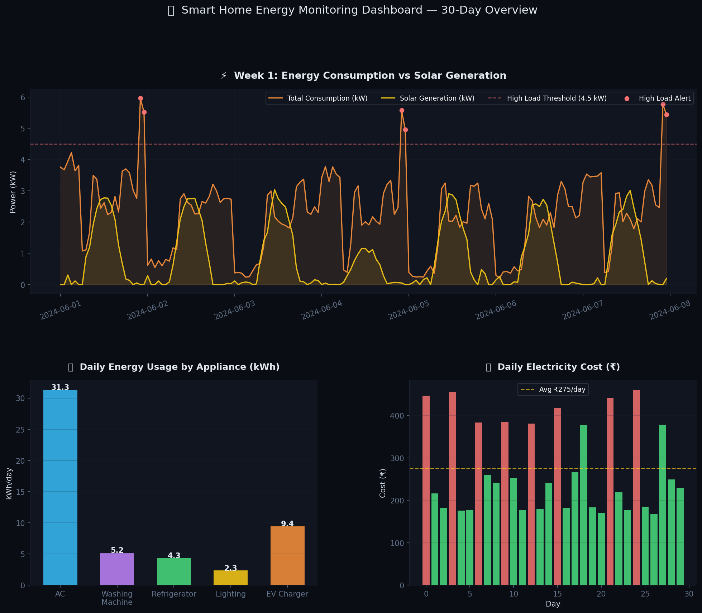
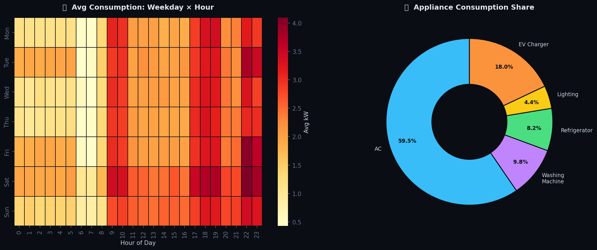
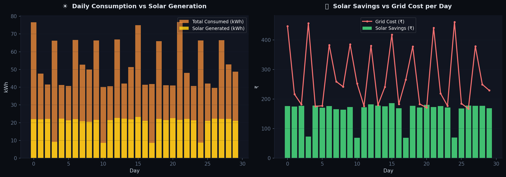

# 🏠 Smart Home Energy Monitoring Dashboard

## 📌 Project Overview

This project simulates a Smart Home Energy Monitoring System using Python.

The dashboard analyzes household energy consumption, solar power generation, appliance-wise usage, electricity costs, and energy efficiency metrics over a 30-day period.

---

## 🚀 Features

- Smart Home Energy Monitoring
- Solar Power Generation Tracking
- Appliance-wise Energy Analysis
- Electricity Cost Monitoring
- Energy Consumption Heatmaps
- Solar Savings Calculation
- High Load Alert Detection
- Daily and Monthly Energy Reports
- Interactive Data Visualization

---

## 🛠 Technologies Used

- Python
- Pandas
- NumPy
- Matplotlib
- Seaborn

---

## 📊 Dashboard Preview

### Main Energy Dashboard

### Appliance Analysis & Heatmap

### Solar Savings Dashboard

### Alert Monitoring Dashboard

---

## 📁 Project Files

- smart_home_energy_simulation.py
- energy_data.csv
- chart1_energy_dashboard.png
- chart2_heatmap_appliance.png
- chart3_solar_savings.png
- chart4_alerts.png

---

## ⚡ Monitored Parameters

- Total Energy Consumption
- Solar Energy Generation
- Net Grid Usage
- Electricity Cost
- Appliance-wise Usage
- AC Consumption
- EV Charger Consumption
- Refrigerator Consumption
- Lighting Consumption
- Washing Machine Consumption

---

## 🚨 Alert Conditions

- High Power Consumption
- Low Solar Generation
- High Electricity Cost Days

---

## 🔮 Future Improvements

- Real-Time Smart Meter Integration
- ESP32 Energy Monitoring
- Mobile App Dashboard
- Cloud Data Storage
- Smart Energy Recommendations
- AI-Based Energy Forecasting

---

## 👨‍💻 Author

Aditya
